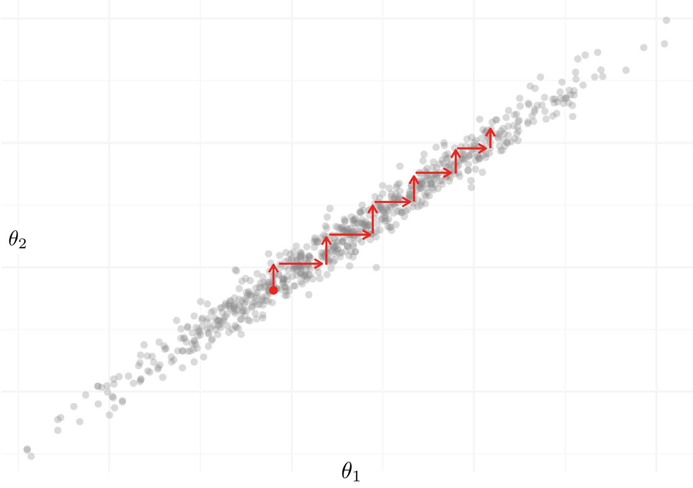
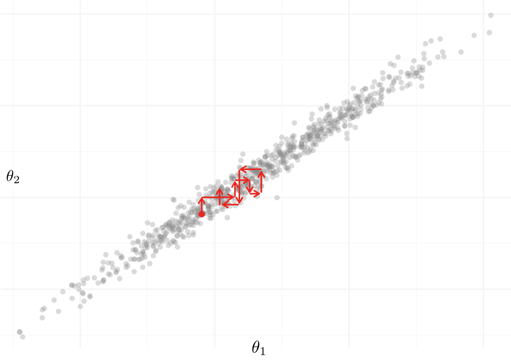
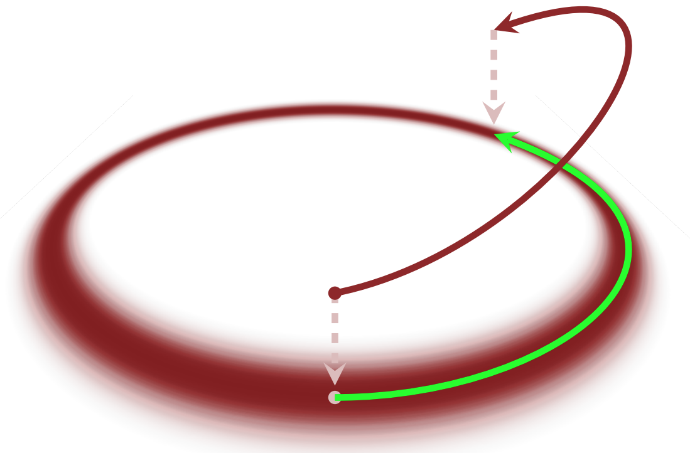
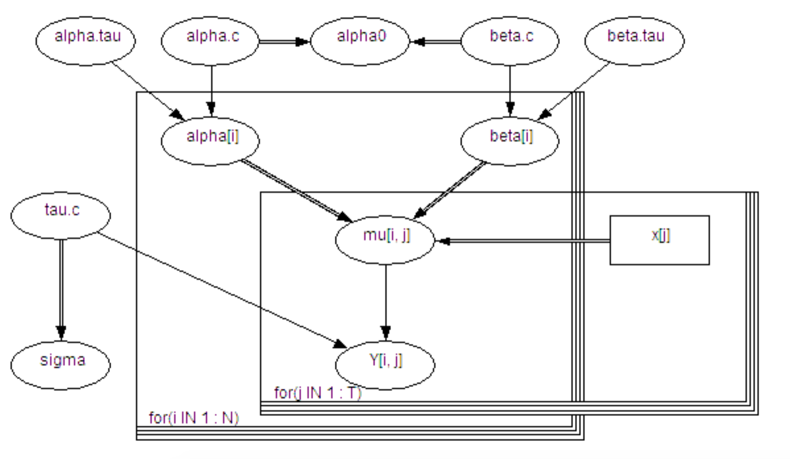

```{r setup, include=FALSE}
knitr::opts_chunk$set(echo = TRUE)
knitr::opts_chunk$set(eval = FALSE)
library(knitr)
library(png)
```

# Introduction

\textcolor{red}{Introductory paragraph.}

## The Bayes Paradigm

In Bayesian statistical inference, we are interested in finding the posterior probability distribution of certain parameters, given a prior distribution and a likelihood for those parameters in our data. Much of Bayesian theory is built upon the definition of conditional probability, which states that we can find the probability of a variable $\theta$, conditioned on $x$, by $$ p(\theta | x) = \frac{p(x | \theta) p(\theta)}{p(x)}.$$ In any Bayesian inference, the first step is to find the joint probability distribution of all the observed and unobserved quantities in the problem. Using the definition of conditional probability, we can then find the posterior distribution of the parameters of interest. Bayes theorem states that the posterior distribution of a parameter $\theta$ is equal to $$p(\theta | \textbf{x}) = \frac{\ell(\theta | \textbf{x}) \pi(\theta)}{\int{\ell(\theta | \textbf{x}) \pi(\theta) d \theta}},$$ where $\ell(\theta | \textbf{x})$ is proportional to the likelihood of $\theta$, conditioned on the data $\textbf{x}$, and $\pi(\theta)$ is the prior distribution of $\theta$.

<!-- Bayes theorem states that the posterior distribution of a parameter $\theta$ is equal to $$p(\theta | x_1, x_2, \dots, x_n) = \frac{\ell(\theta | x_1, x_2, \dots, x_n) \pi(\theta)}{\int{\ell(\theta | x_1, x_2, \dots, x_n) \pi(\theta) d \theta}} = \frac{\ell(\theta | \textbf{x}) \pi(\theta)}{\int{\ell(\theta | \textbf{x}) \pi(\theta) d \theta}},$$ where $\ell(\theta | \textbf{x})$ is proportional to the likelihood of $\theta$, conditioned on the data, and $\pi(\theta)$ is the prior distribution of $\theta$. -->

For example, suppose that $X_i \sim \text{Bern}(\theta)$, and we are interested in inference on $\theta$. A common prior distribution for $\theta$ would be a $\text{Beta}(\alpha, \beta)$, given that $\theta$ is constrained to be between 0 and 1, which is a property of the Beta distribution. Therefore, given that $\theta \sim \text{Beta}(\alpha, \beta)$ for some known values of $\alpha$ and $\beta$, then 
\begin{align*}
  p(\theta | x) &= \frac{\ell(\theta | \textbf{x}) \pi(\theta)}{\int{\ell(\theta | \textbf{x}) \pi(\theta) d \theta}} \\
  &= \frac{\theta ^ {\sum_{i=1}^{n} x_i} (1 - \theta) ^ {n - \sum_{i=1}^{n} x_i} \frac{\Gamma (\alpha + \beta)}{\Gamma(\alpha) + \Gamma(\beta)} \theta^{\alpha - 1} (1 - \theta)^{\beta - 1}}{\int \theta ^ {\sum_{i=1}^{n} x_i} (1 - \theta) ^ {n - \sum_{i=1}^{n} x_i} \frac{\Gamma (\alpha + \beta)}{\Gamma(\alpha) + \Gamma(\beta)} \theta^{\alpha - 1} (1 - \theta)^{\beta - 1} d \theta} \\
  &\propto \theta ^ {\sum (x_i) + \alpha - 1} (1 - \theta) ^ {n - \sum (x_i) + \beta - 1},
\end{align*}
which is the kernel of a $\text{Beta} \left( \sum (x_i) + \alpha, n - \sum (x_i) + \beta \right)$ distribution. Therefore, we can analytically calculate the posterior distribution of $\theta$ as $$p(\theta | x) \sim \text{Beta}\left(\sum (x_i) + \alpha, n - \sum (x_i) + \beta\right).$$

One challenge in bayesian inference comes in evaluating the integral in the denominator of Bayes theorem, which is used to normalize the posterior distribution. If we don't have distributions for the likelihood and prior that are conjugate (or in other words, play nice together), then it is impossible to analytically calculate the posterior distribution. 

## Bayesian Computational Methods

The need for bayesian computational methods arises in our search for an alternative approach to finding the posterior if we cannot do so analytically. Most of the time, the goal of any bayesian analysis is to not to find the posterior distribution, but to calculate expectations with respect to the posterior. However, in order for these estimates to be accurate, we often need to know about the full behavior of that posterior distribution. In bayesian computing, the aim is to obtain individual draws of values that would come from the posterior, and then aggregate a large number of them to compute the expectations we need. 

### Markov Chain Monte Carlo

Approaches using Markov Chain Monte Carlo methods (referred to as MCMC), are commonly used to drawing samples from a target distribution, which in our case is the posterior distribution of our parameter(s). MCMC is an iterative algorithm, where we obtain one draw at a time from the parameter space from which we are trying to sample. In any Markov chain, the marginal distribution of each draw is conditioned on the values of our chain from the previous draw. As we keep obtaining draws, these marginal distributions asymptotically converge to the true target distribution. Therefore, if we run the markov chain for many iterations, we can expect to see draws coming from the true posterior distribution we are trying to estimate. MCMC is the only suitable method for obtaining the posterior distribution when we don't have conjugate priors.

### Metropolis-Hastings Algorithm

When using Markov Chain methods to sample from a posterior distribution, the Metropolis-Hastings Algorithm gives a general approach to construct transitions from one draw to the next. The algorithm has two steps: a proposal step, where we suggest a new draw, and a correction step, where we potentially reject a proposal that move too far away from the typical set from which we are trying to sample (Betancourt paper). 

A probability density for the proposal is needed, which we will call $Q(q'|q)$, where $q$ is our current point, and $q'$ is the proposed point. After sampling from the proposal distribution, the probability of accepting this proposal is calculated as 

$$a(q'|q) = \min \left( 1, \frac{Q(q'|q) \pi(q')}{Q(q|q') \pi(q)} \right).$$

Anytime that a proposal moves closer to the typical set, it will automatically be accepted. If a proposal moves further away, it will be accepted with probability $\frac{Q(q'|q) \pi(q')}{Q(q|q') \pi(q)}$. Choosing a proposal distribution is important. The distribution should be easy to sample from, for any $q$, and should also allow for easy computation of the acceptance probability "ratio". Furthermore, the distribution should strike a balance between each proposed jump traveling a reasonable distance from the current point, while not having proposals rejected too frequently (BDA3). 

A gaussian distribution, such as $Q(q'|q) = N(q'|q, \Sigma)$ is often used for the proposal, including in Gibbs Sampling methods. In this case, because the distribution is symmetric and $Q(q'|q) = Q(q|q')$, then the acceptance probability simplifies to 

$$a(q'|q) = \min \left( 1, \frac{\pi(q')}{\pi(q)} \right).$$

There are some issues that arise with the Metropolis-Hastings algorithm. Each proposal is biased towards larger volumes (such as the tails of the distribution). Although the algorithm will reject these proposals because the density is smaller, this can lead to many rejected proposals. This is especially true in higher dimensions, where in some instances, virtually every proposal step will be rejected, and finishing just one "journey" across the typical set might be unattainable. In simpler scenarios, there is still often autocorrelation in the draws for which we must account (Betancourt).

### Gibbs Sampling

Gibbs Sampling is one of the most common Markov Chain Monte Carlo algorithms used for Bayesian computation. A special case of the Metropolis-Hastings algorithm, a Gibbs sampler works by generating a multi-dimensional markov chain, with one dimension for each unknown variable of interest. By splitting the vector of random unknown variables, the algorithm samples each subvector one by one, conditional on the most recent values of the other variables. 

Lunn et. all outlines the Gibbs sampler algorithm as follows: If we have a vector of unknown parameters $\theta$, where $\theta = (\theta_1, \theta_2, \dots, \theta_k)$, then

1. Choose arbitrary starting values $\theta_1^{(0)}, \theta_2^{(0)}, \dots, \theta_k^{(0)}$ 
2. Complete one iteration of the sampler by getting new values for $\theta$ using the following:
    - Sample a new value for $\theta_1$, from the full conditional distribution of $\theta_1$, given the most recent values of all other elements of $\theta$ and the data:
    
    $$\theta_1^{(1)} \sim p(\theta_1 | \theta_2^{(0)}, \theta_3^{(0)}, \dots , \theta_k^{(0)}, y).$$
    - Sample a new value $\theta_2^{(1)}$ for the second component of $\theta$, from the full conditional distribution $p(\theta_2 | \theta_1^{(1)}, \theta_3^{(0)}, \dots , \theta_k^{(0)}, y)$.
    - Continue this process for the remainder of the $k$ elements of $\theta$.
3. Repeat step 2 for the total decided number of iterations that the sampler will run (BDA3). 

The beauty of the Gibbs sampling strategy is that, no matter how complex the space of the posterior distribution is, sampling from these high-dimensional spaces can be broken down into more straightforward draws from one-dimensional distributions. Gibbs sampling is also easier to understand and implement, which makes it very versatile. However, full conditional distributions for each draw are needed in order to do the method.

Because the Gibbs sampler is a random-walk algorithm, if several variables are highly correlated, traversing the space can take a very high amount of iterations because the step-size needs to be small in order to not step outside the target distribution. A two-dimensional example of this is seen in Figure 1, where the joint distribution of $\theta_1$ and $\theta_2$ is highlgy correlated. Since each Markov transition only allows us to move in the direction of one dimension at a time, it may take many steps in order to travel up and down the parameter space, as demonstrated by the red arrows. In reality, the movement of the chains will be much more random since the algorithm does not know which direction will allow the chain to most efficiently travel through the posterior.

```{r, echo = FALSE, eval = TRUE, out.width = "50%"}


```

![\textit{This is a demonstration of a Gibbs sampler in a highly correlated two-dimensional parameter space. On the left, the ideal behavior of the markov chain is shown, moving as quickly as possible from the bottom-left to the top-right to efficiently sample from the target distribution without stepping outside of it. On the right, we see the more realistic behavior of the markov chain, as the random-walk behavior of the Gibbs sampler moves the chain around in directions that aren't always preferred.}](Paper-Figures/Blank.png)


### Hamiltonian Monte Carlo

The main of objective of Hamiltonian Monte Carlo (HMC) algorithms is to use the knowledge of the geometry of the target distribution to guide sampling efforts, instead of using a random-walk algorithm (Betancourt HMC Youtube talk). Under HMC, the density function of the target distribution is translated into a potential energy function, which is used in Hamiltonian Dynamics, a physics system that is employed to yield Monte Carlo draws. To use this dynamic system to obtain draws, each parameter is transformed into a position variable, where the position of the variable can be interpreted as the value of the parameter at that point in time. Each position variable $q$ also has one associated momentum variable $p$ which will guide the movement of the position variable inside the simulation. 

The joint probability distribution of the position $p$ and momentum $q$ is $\pi(q,p) = \pi(p|q) \pi(q)$. Although both $q$ and $p$ are being used jointly to determine movement, we can find the marginal distribution $\pi(q)$ at any time to recover the values of the position variables.

The Hamiltonian is a set of equations defined as 

\begin{align*}
  H(q,p) &= -\log \pi (p|q) \pi(q) \\
   &= -\log \pi (p|q) - \log \pi(q) \\
   &= - K - V,\\
\end{align*}
where $K$ is potential energy and $V$ is kinetic energy. Taking partial derivatives of the Hamiltonian yields Hamilton's equations, which is where we obtain our vector field that guides the movement of the position variables:

\begin{align*}
  \frac{dq}{dt} &= \frac{\partial K}{\partial p} \\ 
  \frac{dp}{dt} &= - \frac{\partial K}{\partial q} - \frac{\partial V}{\partial q}.
\end{align*}

We can simulate a Hamiltonian Monte Carlo Markov chain where each iteration consists of the following steps:

1. New values for the momentum variables are randomly drawn from their Gaussian distribution, independent of the current values of the position variables
2. A metropolis update is performed, using hamiltonian dynamics to propose a new state for the position variables. The proposed state is either accepted or rejected based on the Hamiltonian Monte Carlo probability function used. If the proposed state is rejected, the next state is the same as the current one.

```{r, echo = FALSE, eval = TRUE, out.width = "50%", fig.align='center'}

```


While the probability distribution for the position variables is defined by the target distribution, the choice of the conditional distribution of the momentum, which is equivalent the kinetic energy function, is up to the user. This choice is very important as it can drastically affect the simulation. There are several common gaussian distributions used for these distributions, which are used by default in the implementations that employ HMC methods (Betancourt).

Hamiltonian Monte Carlo algorithms are very robust, in that the markov chains get "stuck" in complex regions of the posterior less frequently than other common MCMC methods. When the Markov chains do get stuck, it is easy for the program running the sampler to spot the issues and report them to the user. 

There are some inherent challenges that come with HMC methods that are worth mentioning. In every transition step between MCMC draws, a system of differential equations needs to be solved in order to direct the movement of the position variables. This can be difficult in some situations. Additionally, getting the "physics simulation" set up properly for a given model and data set requires several tuning parameters to be set correctly. While some of these parameters can be picked automatically through an adaptation phase before sampling, the user needs to have some knowledge of how to set these initially. This is less of an issue for the no-U-turn sampler, an HMC algorithm that can automatically tune the parameters in a warmup and adaptation phase that occurs before sampling (Gelman, Intro to Stan). 


# Platforms for Bayesian Sampling and Inference

The term "probabilistic programming language" refers to programming languages and tools that natively work with probabilistic models and do inference on them more generally (Hardesty). Within bayesian computing, there are several platforms that are used to do MCMC sampling, to great effect. A bayesian computing platform usually consists of a specification language used to write and program the models, and the engine that performs the computations. We have chosen several of the most common of these platforms to look at more in detail in this paper, with the objective of portraying the strengths, weaknesses, and unique features of each. 

<!-- ### BUGS -->

<!-- The BUGS project, which stands for Bayesian inference Using Gibbs Sampling, began in 1989 in an effort to create a program that utilized MCMC to approximate draws from the posterior distribution in a Bayesian framework. The BUGS language has functions and distributions that allow for specifying relationship between different "nodes" in a bayesian model. While the language itself has a somewhat limited syntax, it is able to describe a very diverse and complex set of models. The BUGS language is declarative, meaning that the order of statements in a model script does not matter since the entire script is evaluated at once, instead of line-by-line in a procedural language.  -->

<!-- Many different programs have been developed that utilize the BUGS syntax to accomplish bayesian sampling, and while these programs have continually evolved, the BUGS syntax has remained very consistent. The Windows program WinBUGS was created by the inventors of the BUGS language, and was a more popular choice for bayesian computation until it became deprecated in 2007. OpenBUGS is now more commonly used in place of WinBUGS, although it's last stable release was in 2014. OpenBUGS communicates better with other software than WinBUGS and is more portable.  -->

<!-- In general, there are six steps needed to run bayesian models in WinBUGS/OpenBUGS: -->

<!-- 1. Specify the model through BUGS syntax and check to make sure the model code is valid. -->
<!-- 2. Load the appropriate data. -->
<!-- 3. Compiling the BUGS model. -->
<!-- 4. Start the simulation at appropriate initial values for the Markov chains. -->
<!-- 5. Simulate draws from the posterior distributions of the unknown parameters of interest. -->
<!-- 6. Gather the results and report summary statistics, along with other appropriate output. -->

## OpenBUGS

OpenBUGS is the oldest of the Bayesian sampling platforms that we use, maintained only as recently as 2014. OpenBUGS is a program for Windows machines, but there are workarounds to run it on MacOS and Linux, such as WINE or a virtual machine.  OpenBUGS can be used through the actual click-and-point application, or through R, using the `R2OpenBUGS` package, which allows for the user to send model scripts and data to OpenBUGS without needing to leave the R interface. OpenBUGS is based on the BUGS model specification language, which is a small-to-moderately sized set of functions and commands that allow for extensive specification of bayesian models. The BUGS language is declarative, meaning that order in which expressions are listed in the model code does not matter (Lunn, BUGS Project). 

The program uses Gibbs sampling methods by default, but also allows for Metropolis-Hastings and Slice sampling. Depending on the model type, OpenBUGS will attempt to group nodes that are correlated together and update them at the same time in each Gibbs sampling transition. In most cases this is not feasible, and parameter nodes are updated one at a time, which can be very slow if there are many parameters or there is a high level of correlation between them (OpenBUGS Manual). 


<!-- Using this method causes OpenBUGS to run invisibly in the background and return the results, unless an argument is specified to debug code in the actual application itself, which can be very useful. When using R to run OpenBUGS, there is little way to know what went wrong if the code errors somewhere without interacting with the OpenBUGS program itself. Using the \texttt{debug = T} argument within \texttt{bugs()} will cause the application to run in the forefront as if it were actually being used directly by the user. This way, any messages given by the application while running can be viewed directly. It is recommend to use \texttt{debug = T} only when debugging, as it does slow down the sampling process slightly.  -->

OpenBUGS has tools to visualize the performance diagnostics of the sampling, which are easy to use. The biggest drawback of using the OpenBUGS application directly is that specifying the data by hand can be tedious if the data is not very small in size or design structure. Using R to specify the data is much easier. 

One main purpose of the BUGS language and software is to easily work with directed acyclical graphs (DAGs). The syntax makes specifying child-parent relationships easy, and the program can interpret the model code and automatically determine the nodes relevant to each full conditional distribution calculation used in Gibbs sampling. Because of how flexible the BUGS language is, any DAG can be represented through a BUGS model (Lunn). One of the unique feature in OpenBUGS is the Doodle tool, which allows for model specification through the creation of a DAG itself by the user, where each represents a variable. A Doodle can be converted into a model, though this is not used often in daily practice.

```{r, echo = FALSE, eval = TRUE, out.width = "50%", fig.align='center'}

```


There are a few well-known weaknesses to OpenBUGS. The software only works on Windows platforms, although there have been ways to use the program on MacOS through The program itself can be prone to failure on occasion, and there are no built-in diagnostic checks to alert the user if the sampling has gone poorly. Diagnosing errors in the model code can be somewhat tedious if the errors given aren't very descriptive. OpenBUGS does not support logical expressions such as the if-else statement, although there are workarounds, such as the `step()` function that is built-in (Lunn). 

## JAGS

JAGS (Just Another Gibbs Sampler) is similar in purpose to OpenBUGS, in that it does analysis of Bayesian models using MCMC methods, and is based on the BUGS model specification language. However, JAGS is designed to be interacted with entirely in R, making the bayesian inference process more seamless, using the R package `rjags`. The `runjags` is an optional package that allows for the JAGS model script to be inputted as a string, and run using the `run.jags()` function. JAGS is also built on C++, which makes running the MCMC sampling process very fast. Sampling diagnostics can be visualized through the `coda` package. There is plenty of documentation and support available for JAGS, which is still maintained (JAGS manual). 

## Nimble

Nimble allows for bayesian computation within R, like JAGS and OpenBUGS, but is also made for more flexible statistical modeling. It uses C++ under the hood to compile models and algorithms. Using the `nimble` package, Nimble can perform MCMC bayesian sampling using common algorithms, but also allows for other types of algorithms to be loaded or custom-built (Michaud). It can also compile other types of algorithms without the BUGS syntax, written in a familiar fashion for R users. 

For the purpose of bayesian sampling using MCMC, Nimble is used very similarly to JAGS and OpenBUGS in practicality, as its model specification language is close to the same. The flexibility of Nimble is not needed in most cases when doing standard bayesian MCMC methods. Nimble can load and use BUGS model and data files if desired. The default sampling method in Nimble is Gibbs sampling, but other algorithms are built-in as well, like Slice sampling, reversible jump MCMC, and Sequential Monte Carlo (Nimble Manual). Because the model has to be compiled first into C++ before sampling each time, this can increase the total computation time as compared to other sampling methods. There is a very accessible user manual for Nimble available online. 

## Stan

Stan is a probabilistic programming language in-and-of itself, used for bayesian statistical modeling. Stan has two key differences from the BUGS-based implementations: it has its own language and syntax, and it uses a different MCMC algorithms. Stan has interfaces for R, Python, and the command line. 

The Stan language is designed to be more flexible and expressive than the BUGS-type languages. Explicit variable declarations are required in Stan, and, unlike the BUGS models, and statements are executed in the order that they appear in the model file. It also supports more programming techniques, such as conditional statements using if-else syntax (Carpenter). 

Stan uses Hamiltonian Monte Carlo sampling methods, which ideally is more efficient and robust than Gibbs or Metropolis-Hastings strategies. In some cases, this can reduce the computational time for many types of statistical models. Like Nimble, Stan model code is translated and compiled to C++ for faster use. In addition, Stan conveniently gives the user the option to store a compiled model in a file, which allows for repeated use without the need to re-compile each time. Stan supports both the Euclidean HMC sampler, and the no-U-turn sampler (NUTS), which is the default method (Carpenter). NUTS automatically adapts the number of leapfrog steps in the warmup phase and does not require user-specified tuning parameters (Stan User Manual). 

In R, Stan is used through the `rstan` package, which allows for data to be loaded through normal R data structures. The biggest practical difference in using Stan compared to other packages is in the model specification process. Stan requires a model object in the form of a .stan file. This file, either created through a character string in R or in a separate text file, can be used by the `stan()` function, which takes the file along with the data to perform the sampling. There is a very robust set of manuals for Stan users, including many papers written on the subject.

## greta

Greta, a more recent addition to the list of bayesian computational implementations, is made specifically for easy use in R. The model and data specification process is intended to be as straightforward as possible for R users, who need not be familiar with other bayesian inference tools. Not only does it utilize Hamiltonian Monte Carlo methods for sampling, but it also uses Google TensorFlow,a machine learning platform from Google, to perform its calculations. This allows for more flexible use of CPUs and GPUs. Greta offers a model visualization tool that does not exist in any of the other Bayesian samplers, in that it can provide a graphical representation of the specified model, similar to a directed acyclical graph (greta Manual). 

As of the writing of this, greta is still in need of lots of development, and lacks an appropriate amount of documentation and support for users, compared to the other implementations mentioned previously. The sampling process can slow compared to the other bayesian methods when using identical sampling configurations, especially for simple models. There are also several types of models for which greta seems unable to properly specify at the moment.

# Example Model

To illustrate how each bayesian computational method is used in practice, we will demonstrate how to construct a model and provide data for a simple Beta-Binomial model for each of the five implementations. 

## Data Preparation

First, we need to prepare the data that we will be using.

```{r}
p <- .25 # binomial p
n <-  10 # binomial n

set.seed(1)

(y <- rbinom(1, n, p))

model_data <- list(
  "y" = y,
  "N" = n
)
```

An extra step is required when using Nimble, which requires for any constant variables to be seperated from other data variables.

```{r}
model_data <- list(
  "y" = y
)

nimble_constants <- list(
  "n" = n 
)
```


## Model Configuration

Next, we will pick some basic bayesian sampling parameters. Here, we will use four markov chains, an initial warmup (or burnin, depending on the sampling method) of 1,000 iterations, and a total iteration count of 10,000.

```{r}
n_chains <- 4L
n_iter <- 1e4L
n_initial <- 1e3L
```

## Model Specification

For several implementations, the model script code can be specified using a seperate text file that is read by the function that compiles and runs the sampler. There are also ways to input the model script as an R object itself. For each implementation, if possible, we will demonstrate how to use both methods of model specification.

### OpenBUGS

When using OpenBUGS through R, we will use the `R2OpenBUGS` library in order to pipe the data and model code into the program rather than using manual entry. One way to specify the model code is by creating a text file that will be read into R when compiling and running the sampler. We will create the text file `model.bugs` with the BUGS model script code inside. 

```{txt}
## model.bugs

model {
  y ~ dbin(p,n)
  p ~ dbeta(1,1)
}
```

In the R script, we will load the `R2OpenBUGS` library, specify a vector of parameters to monitor (which in this case has just one parameter), and run the sampler using the `bugs()` function. As is the case with all bayesian sampling implementations, the function call needs the model, data, parameters, and model configuration settings specified. The `"inits" = NULL` argument tells OpenBUGS to randomly generate initial values for the parameters based on the prior distributions for those parameters, instead of the user having to provide them. 

```{r}
## load library
library(R2OpenBUGS)

## parameters to monitor
bugs_monitor <- c("p")

## run the model
bugs_fit <- bugs(
  "model.file" = "model.bugs", 
  "data" = model_data, 
  "parameters.to.save" = bugs_monitor, 
  "inits" = NULL, 
  "n.chains" = n_chains, 
  "n.iter" = n_iter, 
  "n.burnin" = n_initial
)
```

The alternative approach to model specification when using `R2OpenBUGS` is to provide the model code entirely through R. The user can wrap the model script code inside a function, and then create a temporary text file that will be read into the `bugs()` function.

```{r}
## model script code in a function
bugs_model <- function() {
  y ~ dbin(p,N)
  p ~ dbeta(1,1)
}

## temporary model script text file creation
model.bugs <- file.path(tempdir(), "model.txt")
write.model(bugs_model, bugs.file)
```


### JAGS

Model specification in JAGS is very similar to OpenBUGS in that we can either create a text file, or specify the model through R. Since the specification language for JAGS is based on the BUGS language, the code will often look very similar. 

```{txt}
## model.jags

model {
  y ~ dbin(p,n)
  p ~ dbeta(1,1)
}
```

In R, the model script file location is inputted in the `"model"` argument. 

```{r}
## load libraries
library("rjags"); library("runjags")

## parameters to monitor
jags_monitor <- c("p")

## run the model
jags_fit <- run.jags(
  "model" = "model.jags", 
  "data" = model_data, 
  "monitor" = jags_monitor, 
  "n.chains" = n_chains, 
  "sample" = n_iter, 
  "burnin" = n_warmup
) 
```

To create the model script inside R, we can wrap the script in quotes to make it a character object. 

```{r}
## model script code
model.jags <- "
  model{
    y ~ dbin(p,n)
    p ~ dbeta(1,1)
  }
"
```

### Nimble

The only way to specify a model when using Nimble is to use the `NimbleCode()` function and wrap the code inside using curly braces. Initial values can't be generated automatically and must be specified for all parameters of interest.

```{r}
## load library
library(nimble)

## model script code
nimble_model <- nimbleCode({
  y ~ dbin(p,n)
  p ~ dbeta(1,1)
})

## parameters to monitor
nimble_monitor <- c("p")

## specify initial values of parameters
nimble_inits <- list(
  "p" = rbeta(1,1,1)
)

## run the model
nimble_fit <- nimbleMCMC(
  "code" = nimble_model,
  "data" = model_data,
  "inits" = nimble_inits,
  "monitors" = nimble_monitor,
  "nchains" = n_chains,
  "niter" = n_iter,
  "nburnin" = n_warmup,
  "summary" = TRUE
)
```

### Stan

Running models in Stan requires a .stan file which contains the model script code, written in the unique Stan syntax. This can either be a seperate file, or can be inputted as a character string. It is generally recommended to use a seperate .stan file, espcially when using RStudio, which can do syntax highlighting and point out errors in Stan code.

Here is the .stan file for this example, which is saved as "stan_file.stan". Each Stan file contains a data block, parameters block, and model block at a minimum. The data block initializes each data variable, the parameters block initializes any parameters to monitor, and the model block contains more familiar looking model script code. 

```{txt}
## model.stan

data {
  int<lower=0> y;
  int<lower=0> n;
}

parameters {
  real p;                
}

model {
  y ~ binomial(n,p);
  p ~ beta(1,1);
}
```

The sampler can then be run simply using the `stan()` function call, with the .stan file location specified.

```{r}
## load library
library("rstan")

## run the model
stan_fit <- stan(
  "file" = "model.stan",
  "data" = model_data,
  "chains" = n_chains,
  "iter" = n_iter,
  "warmup" = n_warmup
)
```


### greta

Model specification in greta is more intuitive for R users, but requires the extra step of converting existing data objects into greta arrays, using the `as_data()` function from the `greta` package. 
```{r}
## convert data into greta arrays
y <- greta::as_data(y)
n <- greta::as_data(n)
```

Next, the priors for each parameter of interested are defined using functions that describe the prior distribution paramter values. The relationship between the data and parameters is defined using the  `distribution()` function. The model is compiled using the `model()` function, which requires a vector of all the parameters to model.  Finally, sampling is done by calling `mcmc()`.

```{r}
## load library
library(greta)

## specify prior for parameter(s) of interest
p <- beta(1,1)

## define distribution of data variable and relationship with parameter
distribution(y) <- binomial(n,p)

## compile model and run
greta_model <- model(c(p))
greta_fit <- mcmc(
  "model" = greta_model,
  "n_samples" = n_iter,
  "warmup" = n_warmup,
  "chains" = n_chains
)
```


# Common Bayesian Computation Settings

### Chains

When using Markov Chain Monte Carlo methods, the number of independent Markov chains needs to be specified. It is recommended to use several chains to explore the space of the target distribution, as a single chain may not fully traverse the entire region on its own. For some simpler models that don't have irregular features in the target distribution, using one chain can suffice. Each sampler has an argument in its function call that specifies the number of chains. Some of the samplers have a default value if the number of chains isn't given.

### Iterations

The number of total draws that each Markov chain will collect is a very important setting to get right. If each chain is not set up to run long enough, the parameter space may not be fully explored and the estimates will be inaccurate. Checking convergence statistics can be helpful in determining if the number of iterations is sufficient. An argument specifiying the number of iterations for each chain can be inputted in the function call for each sampler. 

### Warmup

Since our inferences are based on the assmumption that our draws are from the target distribution, it is wise to discard the samples at the beginning of each chain, since it takes time for the Markov chains to converge to the target distribution. The terms "warmup" and "burn-in" are often used to indicate the number of iterations that we will discard at the beginning of each chain when calculating statistics about our posterior distribution. While "warmup" is sometimes used interchangeably with "burnin", the term is usually associated with Hamiltonian Monte Carlo samplers, indicating the number of iterations that the sampler will spend adapting and fine-tuning parameters before collecing official draws. Gibbs Samplers usually use "burnin" to indicate the number of initial draws that will be discarded at the beginning of each chain before keeping track of the draws. 

We can choose these values for warmup/burnin in the function call for each sampler. Some samplers (greta, JAGS, Nimble) treat this argument as a number of iterations to run before starting to track the sampling results, but others (Stan, OpenBUGS) have this be the actual number of iterations to discard out of the total number of specified iterations, so it is important to know which designation a sampler uses. For example, if one were to have 5000 iterations with 1000 burnin iterations, in JAGS this would lead to 1000 discared iterations, followed by 5000 draws, but in OpenBUGS, there would 5000 total draws, with the first 1000 discared, leaving 4000 posterior draws for each chain.

### Thinning

In some cases, there is high autocorrelation between sequential samples in a given chain, which can bias the resulting posterior inference. These autocorrelation issues can be diagnosed using some graphical procedures. If there is autocorrelation, it is wise to "thin" the results by only looking at every ith observation from a chain, such as every 10th observation. While each sampler defaults to including every simulated posterior draw, a user can specify a "thinning rate", which is the rate at which a sampler will keep memory of the observations. A thinning rate of 1 means that every observation will be kept, and a rate of 10 indicates that only every 10th observation will be used. 

### Initial Value Specification

In order to start sampling, each Markov chain needs to have an initial value at which to start for each parameter. These initial values can be either be specified, or can often be randomly generated based on the prior distributions for each parameter of interest. In many cases, it is easiest to have the initial values randomly generated by the sampler. However, in cases where the target distribution is very complex, it is possible that poorly chosen initial values can lead to a chain getting "stuck" in a difficult region, or diverging in the wrong direction. In these cases, a more strategic choice of initial values is advised. Nimble unfortunately requires for these values to be specified instead of randomly generated. Using R to randomly generate the values from the prior distributions can be used in this situation:

```{r}
nimble_inits <- list(
  "alpha" = rnorm(1,0,1000),
  "beta" = rnorm(1,0,1000),
  "sigma" = runif(1,0,10)
)

nimbleMCMC("inits" = nimble_inits, ... )
```

If multiple chains are being used, a list containing a number of lists equalling number of chains can be used:

```{r}
nimble_inits <- list(
  list(
    "alpha" = rnorm(1,0,1000),
    "beta" = rnorm(1,0,1000),
    "sigma" = runif(1,0,10)
  ),
    list(
    "alpha" = rnorm(1,0,1000),
    "beta" = rnorm(1,0,1000),
    "sigma" = runif(1,0,10)
  )
)
```

Alternatively, if a list containing the initial values for one chain is used, these values will be recycled for the remaining chains.

# Common Tricks for Model and Data Specification

When describing a bayesian model through code, there are instances where slightly different specifications are needed based on the sampler being used. Both in model and data specification, the user needs to understand the intricacies of the specific sampling tool being used in order to get the analysis to run properly. This section provides some helpful tips for implementing models in each of the different samplers being examined.

## Model Specification

The most important distinction between each of the samplers is the way that each allows for model specification text to be inputted. 

**OpenBUGS**  

In OpenBUGS, the model specification code must be wrapped inside the expression `model\{\}`:

```{r}
model{
  ...model code here...
}
```

We can either create this text file ourselves, or we can have R generate the text file automatically. The code below demonstrates how to create the model text file entirely in R.

```{r}
bugs_model <- function() {
  ...model code here...
}

bugs.file <- file.path(tempdir(), "model.txt")
write.model(bugs_model, bugs.file)

bugs("model" = bugs.file, ... )
```

### JAGS 

The JAGS sampler was intended to allow for model specification code to be almost identical to OpenBUGS, so the implementation is very similar. Like in OpenBUGS, the user can create a text file with the model code, or specify the model in R directly. When using the R approach, there are two common approaches, one using the `rjags` package, and one using the `runjags` package. We use the latter, which allows for the model code to be specified in a multi-line character string:
  
```{r}
jags_model <- "
  model{
  ...model code here...
  }
"
  
run.jags("model" = jags_model, ... )
```

### Nimble  

Model specification in Nimble is extremely similar to OpenBUGS as well. Model code is wrapped inside the `nimble` package function `nimbleCode()`, and then fed into `nimbleMCMC()` sampler function:

```{r}
nimble_model <- nimbleCode({
  ...model code here...
})

nimbleMCMC("code" = nimble_model, ... )
```

### Stan 

The Stan model specification language is significantly different than other samplers, in that a .stan file is fed to the C++ compiler. A .stan file has a very unique model specification format, which divides code into "data", "parameter", and "model" blocks at a minimum. When needed, "transformed data" and "transformed parameters" blocks are also used. The basic format for model specification is provided below:

```{r}
data {
  ...data specified here...        
}

parameters {
  ...parameters specified here...                
}

model {
  ...model code here...
}
```

Each data variable and and parameter variable needs to be initialized in the appropriate block, along with associated domain limits. For example, if one were initializing a rate parameter for an exponential distribution called "lambda", it would be initialized with a lower bound of 0:

```{r}
parameters {
  <lower=0> lambda;               
}
```

A character string specifying the path to the .stan file is then passed to `stan()`.

```{r}
stan_file <- "file.stan"
stan("file" = stan_file, ... )
```

## Data Specification and Input

Specifying data for the bayesian samplers in R is very straightforward. In OpenBUGS, JAGS, and Stan, a list containing each data object or constant can be passed to the function that calls the sampler. For example, in JAGS, the data might constructed like this: 

```{r}
n <-  10 # binomial n
y <- rbinom(1, n, p)

jags_data <- list(
  "y" = y,
  "n" = n
)

run.jags("data" = jags_data, ... )
```

In Nimble, the constants need to be specified in a separate list from the data.

```{r}
n <-  10 # binomial n
y <- rbinom(1, n, p)

nimble_data <- list(
  "y" = y
)

nimble_constants <- list(
  "n" = n
)


nimbleMCMC("data" = nimble_data, "constants" = nimble_constants, ... )
```

## Monitoring Parameters

In OpenBUGS, JAGS, Nimble, and Stan, specifying parameters for the sampler to monitor is as easy as providing a character vector with the names of the parameters to monitor:

```{r}
jags_monitors <- jags_monitor <- c("alpha", "beta")

run.jags("monitor" = jags_monitor, ... )
```

## Stan Probabilty and Sampling Statements

Inside the model block of a stan file, probability statements can be written in the same convention as in other bayesian sampling methods

```{r}
model{
  y ~ binomial(n,p);
  p ~ beta(1,1);
}
```

This kind of probability statement does not actually perform any sampling, but is instead transformed into a statement about the incremental log probability density of a target distribution. The log probability density function can be specified directly. 

```{r}
model {
  target += binomial_lpdf(y | n, p);
  target += beta_lpdf(p | 1, 1);
}
```

Either method yields the same result, but in some cases it is advantageous to use the incremental log probability density (or cumulative density) function to get exact log probability values for the model. In general, using the standard sampling statement syntax is preferred since it is easier to understand.

## greta's Unique Specification Language

Implementing models in greta is very unique in that each data variable or parameter is initialized seperately with its own line of R code.  Each data object in R is redefined using the `as\_data()` function in the greta package:
```{r}
y <- as_data(rpois(5, theta))
```

Each parameter is defined using a function indicating the prior distribution and the chosen prior parameters.

```{r}
theta <- gamma(3,1)
```

Once all the variables have been defined, the relationship between the data and the unknown parameters is established using the `distribution()` function:

```{r}
distribution(y) <- poisson(theta)
```

Finally, the greta model is constructed using `model()` function, which takes each of the monitored parameters as arguments:

```{r}
greta_model <- model(theta)

mcmc("model" = greta_model, ... )
```

# Benchmarking

There are several important performance aspects to consider when assessing bayesian computational strategies. The main two that we will focus on are computation time and computational accuracy. A reliable sampler should both be efficient in computation and give trustworthy posterior estimations. We have conducted simulations to benchmark OpenBUGS, JAGS, Nimble, Stan, and greta to compare their performance in each area.

## Computation Time Benchmarking

In order to assess each sampler's performance across many different scenarios, we chose 16 different model types on which to measure the computation time performance, including simple conjugate models, regression models, hierarchical models, time series models, survival models, and others. For each platform, we ran computations on each model, both for a small dataset, and a large dataset. Each model computation was done a total of 200 times for each implementation. In all computations, the MCMC sampling was performed with four chains, using 10,000 posterior draws, with a warmup / burnin of 1000 iterations prior to sampling. Each sampling was computed in parallel, on the same workstation iMac (2017, 8 GB 2400 MHz DDR4 Memory, 3.4 GHz Quad-Core Intel Core i5 Processor, running MacOS Catalina). 

## Computation Time Results

\textcolor{red}{Computation time results here.}

## Posterior Estimation Accuracy Benchmarking

When using MCMC methods to approximate a posterior distribution, the samples that we collect should, in theory, be coming from the posterior itself. While we cannot determine if a single draw is from that distribution, there are ways to aggregate all of the draws and see how closely the empirical distribution matches the "true" distribution. For certain conjugate probability models, we can analytically calculate the posterior distribution for the parameters of interest. In these cases, we will use the Total Variation Distance to measure the distance between the true posterior distribution and the estimated posterior distribution, in the form of an empirical distribution obtained from MCMC sampling.

### Total Variation Distance

Total Variation Distance (TVD) is a metric that defines the distance between two probability measures on the same space. For two probabilty measures $P$ and $Q$, the TVD is defined as

$$\delta(P,Q) = \textrm{sup}_{A \in B} \left| P(A) - Q(A)\right|.$$

When we are dealing with probability distributions on $\mathbb{R}$, the TVD becomes 

$$\delta(P,Q) = \frac{1}{2} \int_\mathbb{R} \left|p(x) - q(x)\right| dx.$$

\textcolor{red}{Proof if needed.}

When our probability models allow us to calculate the analytical posterior distribution, we can use the TVD to calculate the distance between the "true" distribution and the estimated one. Using this method, we can compare the posterior estimation accuracy of different bayesian computation implementations (Casement) (Michel). 

To compare the posterior estimation accuracy of our five implementations, we picked six different data models with conjugate prior distributions (such as binomial data with a beta prior for $\theta$), and randomly simulated data to analytically calculate the true posterior distribution in each case. Then, for each of OpenBUGS, JAGS, Nimble, Stan, and greta, we ran a set of 50 simulations using the same data, each time running the MCMC sampler with four chains, 10,000 iterations, and a warmup or burnin of 1000, and obtained the samples from the posterior for each to calculate the Total Variation Distance between the true posterior and empirical posterior. For each model, we have aggregated the TVD values for each implementation.

### Total Variation Distance Results

\textcolor{red}{TVD results here.}

### Posterior Estimation for Non-Conjugate Models

In most cases where we do not have a conjugate data distribution and prior distribution, an analytic posterior cannot be computed. To obtain an approximation of the true posterior to the best of our ability, we will use Hamiltonian Monte Carlo (through Stan) to get a very large number of draws (way more than needed) from the posterior distribution. We will then treat this empirical posterior distribution as our "true" distribution, and compare it to empirical posteriors from OpenBUGS, JAGS, Nimble, Stan, greta, when they are used with much smaller iterations. 

### Results

\textcolor{red}{Results here.}

# Installation

\textcolor{red}{Insert section on installation process for each implementation here.}

# Conclusion

\textcolor{red}{Insert conclusion and discussion here.}

\newpage

# Appendix

## How to Specify Tricky Models

Each sampler has its own unique methods for using certain bayesian model details. We provide illustrations for some of the most common ones.

**Truncated Distribution**  

Using a truncated distribution is a common practice in bayesian modeling, especially when specifying priors for parameters with positive domains. The syntax for specifying a truncated distribution is slightly different for each sampling method. Below we are using a truncated normal distribution with a lower bound of zero and no upper bound:

```{r}
## Truncated normal distribution in OpenBUGS
tau ~ dnorm(0,1) I(0, )

## Model Text for OpenBUGS using R2OpenBUGS to create the text file
tau ~ dnorm(0,1) %_% I(0, )

## JAGS
tau ~ dnorm(0,1) I(0, )

## Nimble
tau ~ T(dnorm(0,1), 0,)

## greta
tau <- normal(0,1, truncation = c(0,Inf))

## Stan
# Parameter block initialization
real<lower=0> tau;

# Model block specification
tau ~ normal(0,1);

# Alternative solution
tau ~ normal(0,1) T[0,]

```

**Flat Priors**  

Sometimes using a flat, diffuse prior is appropriate. Most of the samplers allow for improper flat priors, although JAGS does not. In Stan, a parameter has is given a flat, improper prior by default if it doesn't have a distribution assigned. Simply declaring the parameter will do the job. 
```{r}
## Flat prior in OpenBUGS
theta ~ dflat()

## Nimble
theta ~ dflat()

## greta
theta <- variable()

## Stan
# Parameter block initialization
real theta;

```

**Distribution Parameter Order**  

Some samplers use different parameter orders for certain distributions. 

Some use the $\sigma$ parameterization of the normal distribution, where $\sigma$ is the standard deviation, and others use $\tau$ instead, where $\tau = 1 / \sigma^2$. Among bayesian samplers, JAGS, OpenBUGS, and Nimble use the $\tau$ parameteriztion, while Stan and greta use $\sigma$. 

\textit{\textbf{Normal}}: The $N(\mu,\sigma)$ parameterization is used by Stan and greta, where $\sigma$ is the standard deviation. The $N(\mu,\tau)$ parameterization is used by JAGS, OpenBUGS, and Nimble, which uses the precision parameter $\tau = 1 / \sigma^2$. The same parameterization guidelines are the same for the student-t distribution as well.

\textit{\textbf{Binomial}}: The $Bin(n,p)$ parameterization is used by OpenBUGS, JAGS, and Nimble, while the $Bin(p,n)$ parameterization is used by Stan and greta.

\textit{\textbf{Gamma}}: The $Gam(\alpha,\lambda)$ parameterization, where $\alpha$ is a shape parameter and $\lambda$ is a rate parameter, is used by all five implementations.

\textit{\textbf{Weibull}}: The $Weibull(v,\lambda)$ parameterization is used by OpenBUGS, JAGS, Nimble, and greta, where $\lambda$ is a shape parameter. The $Weibull(v,\sigma)$ parameterization is used by Stan, where $\sigma = 1 / \lambda$.

**Equations inside distribution parameters**  

In order to utilized calculated parameters inside OpenBUGS, a variable must be defined using the assignment operator that is the result of the calculation:

```{r}
y_hat <- alpha + beta * x
y ~ dnorm(y_hat, tau)
```

Fortunately, the other samplers allow for variable calculations inside the actual parameter definition of a distribution function. Here is an example in JAGS: 

```{r}
y ~ dnorm(alpha + beta * x, tau)
```


